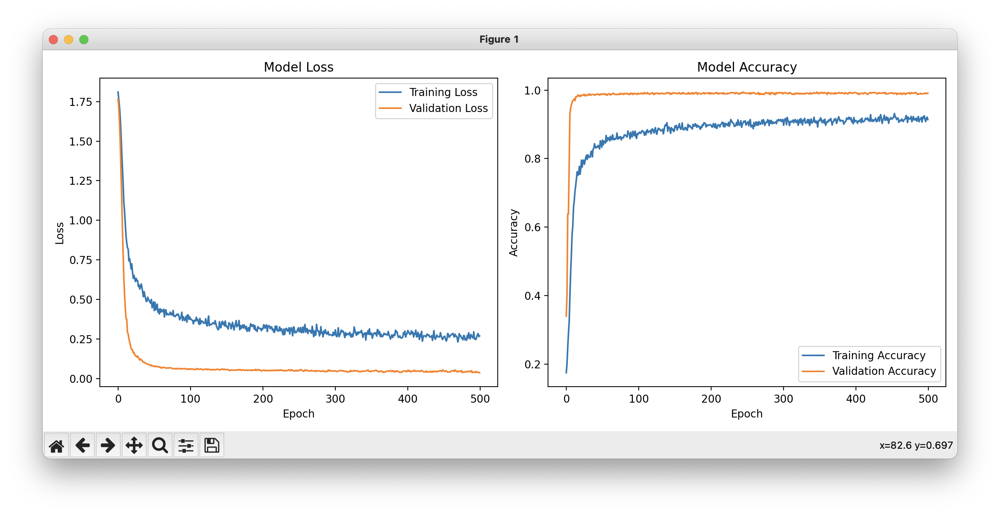

# HoloTouch

**HoloTouch** is an application that enables users to remotely control and ***switch between*** various PC functions, such as volume, brightness, and mouse movements, as well as execute different types of mouse clicks (double click, single click, right click etc.). The project leverages machine learning to recognize gestures and map them to specific actions.


## Key Features

### Gesture-Based PC Control

HoloTouch uses hand gestures to remotely control various PC functions, such as:
- **Volume Control**: Adjust system volume up or down.
- **Brightness Control**: Increase or decrease screen brightness.
- **Mouse Movements**: Control the mouse position and perform various clicks (left-click, right-click, and double-click).
- Switching between the above control utilities through gesturing.


### Machine Learning for Gesture Recognition

The project utilizes a Keras-based deep learning model to recognize hand gestures. The model is trained on hand landmark data extracted using tools like MediaPipe. The gestures are mapped to specific PC actions, enabling a touchless control experience.




## Customization

**HoloTouch** can be tailored to better fit your specific needs by adjusting various parameters and constants in the `main.py` script. Below are instructions on how to customize the application:

### 1. Adjust Gesture Recognition Settings

In `main.py`, you can configure the following parameters to change how gestures are recognized and handled:

- **`wait_time`**: Adjust the time (in seconds) a gesture must be held to trigger a control action change. Increase or decrease this value depending on how responsive you want the gesture recognition to be.
    ```python
    wait_time = 1.5
    ```

- **`resolution_x`** and **`resolution_y`**: Set the resolution of the webcam capture. This affects the quality and processing speed of the video feed.
    ```python
    resolution_x = 1280
    resolution_y = 720
    ```

### 2. Customize Gesture Signals

Modify the signals that activate or deactivate various controls by changing the following constants:

- **`mouse_control_activation_signal`**: Define which gesture activates mouse control.
    ```python
    mouse_control_activation_signal = INDEX
    ```

- **`mouse_control_deactivation_signal`**: Define which gesture deactivates mouse control.
    ```python
    mouse_control_deactivation_signal = ZERO
    ```

- **`brightness_control_signal`**: Set the gesture that controls the screen brightness.
    ```python
    brightness_control_signal = PEACE
    ```

- **`volume_control_signal`**: Set the gesture that controls the system volume.
    ```python
    volume_control_signal = THREE
    ```

- **`brightness_control_time`** and **`volume_control_time`**: Adjust the duration (in seconds) for which the brightness and volume controls are active after activation.
    ```python
    brightness_control_time = 3
    volume_control_time = 3
    ```

### 3. Modify Control Actions

You can customize how different PC functions are controlled by modifying the corresponding scripts:

- **`brightness_control.py`**: Adjust the logic for changing screen brightness.
- **`volume_control.py`**: Modify the logic for adjusting system volume.
- **`mouse_control.py`**: Change how the mouse movements and clicks are handled.

### 4. Update the Hand Gesture Model

If you want to use a different gesture recognition model:

- Train a new model using the scripts in the `/model/` directory.
- Save the trained model as `hand_landmarks_model.h5`.
- Replace the existing model file in the `/model/` directory with your new model.

### 5. Handle Edge Cases and Errors

To handle specific scenarios or improve the robustness of the application:

- Modify the error handling in `main.py` to address issues with video capture or gesture processing.
- Add custom logging or notifications to track the status of gesture recognition and control actions.

## Directory Structure

The project is divided into several key files and directories, each with a specific purpose:

### `/model/`
Contains scripts and data required for gesture recognition model training.

- **`data.py`**: This script is responsible for generating and processing training data used by the gesture recognition model.
- **`hand_landmarks.csv`**: A CSV file containing the processed hand landmark data extracted from gestures, used for training the model.
- **`hand_landmarks_model.h5`**: The trained Keras model file used for hand gesture recognition.
- **`history.png`**: A a graph showing the training history of the model.
- **`predictor.py`**: This script handles the task of predicting gestures based on the trained model.
- **`scrambler.py`**: A utility for scrambling the dataset.
- **`train.py`**: The main training script, which builds and trains the Keras deep learning model using the data generated and processed by `data.py`.

### Root Files

- **`brightness_control.py`**: Script for controlling the screen brightness based on recognized hand gestures.
- **`drawer.py`**: A utility that helps draw dashed lines and sliders.
- **`main.py`**: The main entry point of the application that ties together gesture recognition and PC control functionalities.
- **`mouse_control.py`**: Handles mouse movements and clicks using recognized gestures.
- **`timer.py`**: A utility class that handles scheduling functions.
- **`volume_control.py`**: Script for controlling the system volume using hand gestures.

## License

This project is licensed under the MIT License - see the `LICENSE` file for details.
